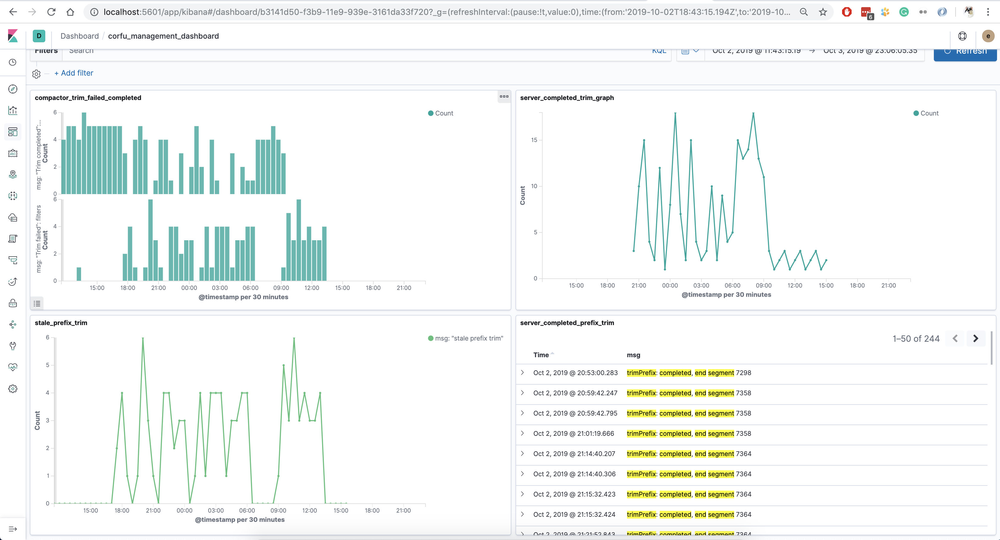
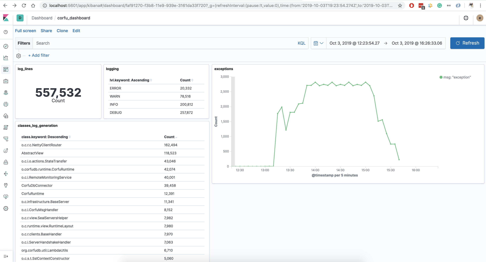

## CorfuLAP - Corfu Log Aggregation Platform

The Corfu log aggregation platform built on top of [the ELK Stack](https://www.elastic.co/what-is/elk-stack).

**So, what is the ELK Stack?** "ELK" is the acronym for three open source projects: Elasticsearch, Logstash, and Kibana. 
- Elasticsearch is a search and analytics engine. 
- Logstash is a server‑side data processing pipeline that ingests data from multiple sources simultaneously, 
transforms it, and then sends it to a "stash" like Elasticsearch. 
- Kibana lets users visualize data with charts and graphs in Elasticsearch.

### The platform features
 - Automation tools to download, unpack and load the log data from support bundles. 
 - Log aggregation, flat log structure for the entire cluster, including corfu, mp, cpp, cbm, compactor and so on.
 - Fast requests, a query language and visualization dashboards, provide high quality user experience.
 - A scalable solution that can be extended and customized, highly automated.
 

### Visualization
Kibana provides powerful and flexible UI and QueryEngine.

### Corfu Dashboards
 - The corfu management dashboard - contains visual components that show the corfu cluster state.
 Right now it contains information about failed and successful trimming operations 
 on the server and compactor sides.
 
 
 
 - The corfu common dashboard - provides common information about the corfu cluster,
 like the total amount of log lines, how many records on each log level, 
 how much of the log data is generated by the classes, total number of exceptions in the log.
 
   

## Automation tools
Prepare logs for stashing. 
Execute:

- `./init.sh` - created the initial directory structure for the CorfuLAP project.
- `./gradlew processing -Pbug=bug123 -Pbundle=1 -Purl=http://support.bundle/mgr1.tgz` - 
  downloading a support bundle archive. You can download as many support bundles as needed.
- `./gradlew unpack -Pbug=bug123 -Pbundle=1.tgz` - unpack corfu log directory 
  and prepare to export logs to the ELK stack.
- `elk-up.sh` - start the CorfuLAP project.
- `./elk-down.sh` - shutdown the platform

### Conclusion
The CorfuLAP is a flexible and powerful tool that can help to improve developer's and QA's productivity
and can provide a common way how to analyze application logs, faster approach how to find bugs, 
and a communication protocol between a QA/customer and a development team. 

Authors:
- **Viacheslav Petc**
- **Pavel Zaytsev**